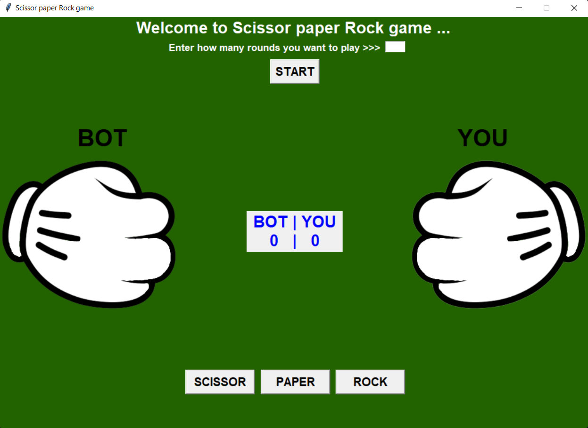

# Scissor-Paper-Rock Game
This game is createde using `Python` language along with `TKinter` library
## How to play this game
- Access the Python code in your local IDE and download all png files.
- As mentioned inside the code in comment line (line no. - 223) provide the png file path in code according to your computer.
- Run the code
## Gaming Graphics sample

